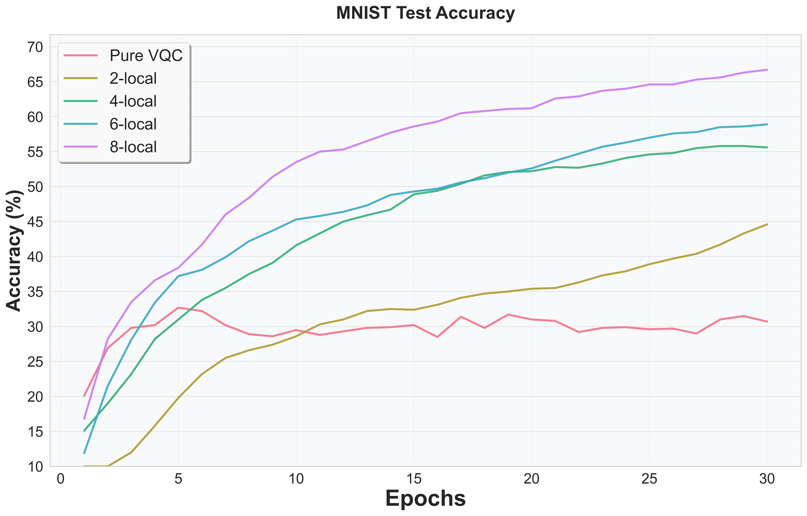
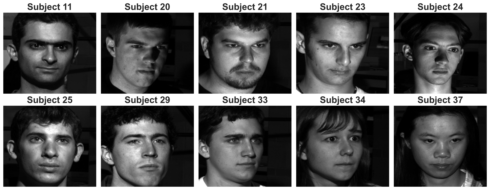
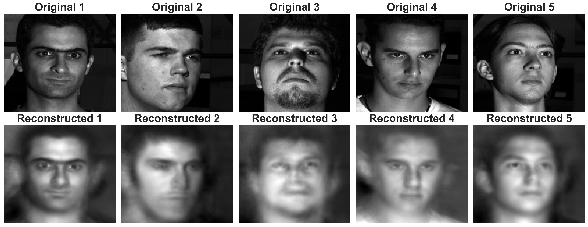
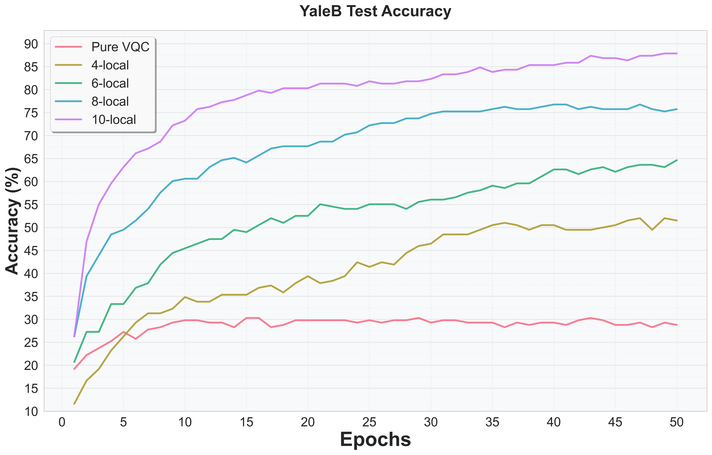

# Diagonal Adaptive Non-local Observables (DANO)

Code for the paper **"Diagonal Adaptive Non-local Observables on Quantum Neural Networks"** (ICCCN 2026) — [[arXiv]](https://arxiv.org/abs/2605.15410).

> **TL;DR:** DANO couples a variational quantum circuit (VQC) with a trainable *diagonal* observable $\Lambda(\lambda)$, reducing $k$-local Hermitian parameters from $O(4^k)$ (full ANO) to $O(2^k)$ while retaining the same expressivity class under the Solovay–Kitaev theorem.

This work builds on two predecessor papers:
- **Learning to Measure** — [Learning to Measure Quantum Neural Networks](https://ieeexplore.ieee.org/document/11011001), ICASSP 2025 Workshop on Quantum Machine Learning.
- **ANO** — [Adaptive Non-Local Observable on Quantum Neural Networks](https://ieeexplore.ieee.org/document/11249836), IEEE QCE 2025.

## Repository Structure

```
MNIST/
  DANO_sliding_klocal_MNIST.py      # DANO training on MNIST
  ANO_sliding_klocal_MNIST.py       # ANO training on MNIST
  VQC_cf_DANO_reduced_MNIST.py      # Pure VQC baseline on MNIST

YaleB_face/
  DANO_sliding_klocal_Yale_Extended_B_face_PCA.py    # DANO training on Yale B
  ANO_sliding_klocal_Yale_Extended_B_face_PCA.py     # ANO training on Yale B
  VQC_cf_DANO_reduced_YaleB.py                       # Pure VQC baseline on Yale B
  yale_images_pca.npy                                # Preprocessed PCA features (16-dim)
  yale_labels.npy                                    # Subject labels
```

## Methods

| Method | Observable | Params per $k$-local obs. | Circuit backend |
|--------|-----------|--------------------------|-----------------|
| **DANO** | Diagonal $\Lambda(\lambda) \in \mathbb{R}^{2^k}$ | $O(2^k)$ | `default.qubit` |
| **ANO**  | Full Hermitian $\tilde{H}(\phi) \in \mathbb{H}(k)$ | $O(4^k)$ | `default.qubit` |
| **Pure VQC** | Fixed Pauli-Z | — | `lightning.qubit` |

All three share the same VQC backbone: Hadamard + $R_y$ data encoding, followed by $L$ layers of brickwork CNOT entanglement + $R_y$ rotations.

## Requirements

```
pennylane
torch
torchvision      # MNIST only
scikit-learn
numpy
tqdm
```

```bash
pip install pennylane torch torchvision scikit-learn numpy tqdm
```

---

## Experiment 1 — MNIST Digit Classification

**Setup:** $28\times28$ images downsampled to $4\times4$ → **16 qubits**. Balanced subset: 9,000 train / 1,000 test across 10 classes. VQC depth $L=6$ → **96 circuit parameters**.

### DANO (paper Table I: k = 2, 4, 6, 8)

```bash
python DANO_sliding_klocal_MNIST.py --k-local 2 --vqc-depth 6 --resize-img 4 --epochs 30 --batch-size 200 --lr 1e-3 --lr_H 1e-1
python DANO_sliding_klocal_MNIST.py --k-local 4 --vqc-depth 6 --resize-img 4 --epochs 30 --batch-size 200 --lr 1e-3 --lr_H 1e-1
python DANO_sliding_klocal_MNIST.py --k-local 6 --vqc-depth 6 --resize-img 4 --epochs 30 --batch-size 200 --lr 1e-3 --lr_H 1e-1
python DANO_sliding_klocal_MNIST.py --k-local 8 --vqc-depth 6 --resize-img 4 --epochs 30 --batch-size 200 --lr 1e-3 --lr_H 1e-1
```

### ANO (paper Table I: k = 2, 4)

> ANO at k=6 and k=8 exceeds 128 GB RAM in statevector simulation and is omitted.

```bash
python ANO_sliding_klocal_MNIST.py --k-local 2 --vqc-depth 6 --resize-img 4 --epochs 30 --batch-size 200 --lr 1e-3 --lr_H 1e-1
python ANO_sliding_klocal_MNIST.py --k-local 4 --vqc-depth 6 --resize-img 4 --epochs 30 --batch-size 200 --lr 1e-3 --lr_H 1e-1
```

### Pure VQC baseline

```bash
python VQC_cf_DANO_reduced_MNIST.py --vqc-depth 6 --resize-img 4 --epochs 30 --batch-size 200 --lr 1e-2
```



---

## Experiment 2 — Extended Yale Face Database B

**Setup:** 10-subject face identification. Each image is reduced to **16 dimensions via PCA** (precomputed in `yale_images_pca.npy`), rescaled to $[-\pi, \pi]$, split 80/10/10 (train/valid/test) → 1,584 / 198 / 198 samples. VQC depth $L=6$ → **96 circuit parameters**.


*10 individuals selected for classification.*


*Inverse-PCA reconstructions of the first 5 subjects, confirming the 16-dim representation retains identity-relevant structure.*

### DANO (paper Table II: k = 4, 6, 8, 10)

```bash
python DANO_sliding_klocal_Yale_Extended_B_face_PCA.py --k-local 4  --vqc-depth 6 --epochs 30 --batch-size 32 --lr 1e-3 --lr_H 1e-1
python DANO_sliding_klocal_Yale_Extended_B_face_PCA.py --k-local 6  --vqc-depth 6 --epochs 30 --batch-size 32 --lr 1e-3 --lr_H 1e-1
python DANO_sliding_klocal_Yale_Extended_B_face_PCA.py --k-local 8  --vqc-depth 6 --epochs 30 --batch-size 32 --lr 1e-3 --lr_H 1e-1
python DANO_sliding_klocal_Yale_Extended_B_face_PCA.py --k-local 10 --vqc-depth 6 --epochs 30 --batch-size 32 --lr 1e-3 --lr_H 1e-1
```

### ANO

```bash
python ANO_sliding_klocal_Yale_Extended_B_face_PCA.py --k-local 4 --vqc-depth 6 --epochs 30 --batch-size 32 --lr 1e-3 --lr_H 1e-1
```

### Pure VQC baseline

```bash
python VQC_cf_DANO_reduced_YaleB.py --vqc-depth 6 --epochs 30 --batch-size 32 --lr 1e-2
```



---

## Citation

If you use this code, please cite the DANO paper and the two ANO predecessor works it builds upon:

```bibtex
@inproceedings{tseng2026dano,
  title        = {Diagonal Adaptive Non-local Observables on Quantum Neural Networks},
  author       = {Tseng, Huan-Hsin and Li, Yan and Lin, Hsin-Yi and Chen, Samuel Yen-Chi},
  booktitle    = {2026 International Conference on Computer Communications and Networks (ICCCN)},
  year         = {2026},
  eprint       = {2605.15410},
  archivePrefix = {arXiv}
}

@inproceedings{chen2025learning,
  author    = {Chen, Samuel Yen-Chi and Tseng, Huan-Hsin and Lin, Hsin-Yi and Yoo, Shinjae},
  title     = {Learning to Measure Quantum Neural Networks},
  booktitle = {ICASSP 2025 Workshop on Quantum Machine Learning in Signal Processing and Artificial Intelligence},
  year      = {2025},
  eprint    = {2501.05663},
  archivePrefix = {arXiv}
}

@inproceedings{lin2025ano,
  author    = {Lin, Hsin-Yi and Tseng, Huan-Hsin and Chen, Samuel Yen-Chi and Yoo, Shinjae},
  title     = {Adaptive Non-Local Observable on Quantum Neural Networks},
  booktitle = {2025 IEEE International Conference on Quantum Computing and Engineering (QCE)},
  year      = {2025},
  volume    = {01},
  pages     = {1884--1893},
  eprint    = {2504.13414},
  archivePrefix = {arXiv},
  doi       = {10.1109/QCE65121.2025.00206}
}
```
